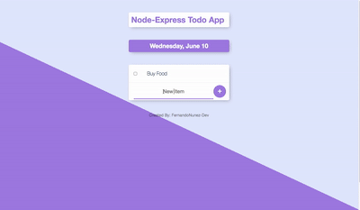

<h1 align="center">Nodejs-Express-Todo-App</h1>

 


<p align="center">
<h3 align="center">With This Application<h3>
I utilized nodejs templating engine [EJS](https://www.ejs.co/) to create a Todo App. I also utilized
node's [Express](https://www.expressjs.com/) framework on the backend. EJS or Embedded Javascript Templating is a templating engine used by [Nodejs](https://www.nodejs.org/en/). Template engine helps to create an HTML template with minimal code. Also, it can inject data into  HTML template at the client side and produce the final HTML. EJS is a simple templating language which is used to generate HTML markup with plain JavaScript. It also helps to embed JavaScript to HTML pages
</p>

- - - - - - - - -


<p align="center">
<h3 align="center">I Incorporated Express</h3>
Now, the first thing I needed to do is to set EJS as the templating engine with Express which is a Node.js web    application server framework, which is specifically designed for building single-page, multi-page, and hybrid web  applications. It has become the standard server framework for node.js.
</p>


    Here's A Brief Look @ The Application(Gif of node-express-todo-app).
    
   
   
    

    
    
    
    
    
    


    EJS is a simple templating language 

    
    that lets you generate HTML markup 
    
    
    with plain JavaScript. 
   

    


<h2 align="center">Features</h2>


<p align="center">
-[Nodejs]

<p align="center">
-[Express]

<p align="center">
-[EJS]

<p align="center">
-[Server Side Todos]


- - - - - - - - -

<p align="center">
  
<h2 align="center">Recommended Tools</h2>


The following tools are recommended for a EJS Template project. Also you will find included below some links for building some complex UI animations.
   
- [EJS](https://ejs.co/) A Node Templating Library.
- [Express](https://expressjs.com/), Express is a minimal and flexible Node.js web application framework that provides HTTP utility methods and middleware at your disposal, creating a robust API is quick and easy.
- [CSS-Tricks](https://css-tricks.com/building-a-complex-ui-animation-in-react-simply), For building complex UI animations in your web applications.
- [Nodejs](https://nodejs.org/en/) Nodejs is a platform built on Chrome's JavaScript runtime for easily building fast and scalable network applications. Nodejs uses an event-driven, non-blocking I/O model that makes it lightweight and efficient, perfect for data-intensive real-time applications that run across distributed devices.
</p>


<h2>Installation</h2>


   ```sh
   git clone https://github.com/FernandoNunez-Dev/Nodejs-Express-Todo-App
   ```

   ```sh
   cd Nodejs-Express-Todo-App
   ```

   ```sh
   npm install
   ```

   
   
   
  visit `http://localhost:3000/`


 
- _Author_
  
  - https://github.com/FernandoNunez-Dev
 
 


- _Software Utilized_
  
  - [EJS](https://ejs.co/) 
  - [Express](https://expressjs.com/)
  - [Nodejs](https://nodejs.org/en/)
  - [CSS-Tricks](https://css-tricks.com/building-a-complex-ui-animation-in-react-simply)
  - [Html5](https://html.com/)
  - [Css](http://www.css3.info/)
